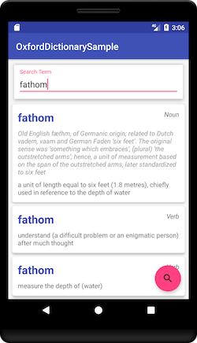

# Oxford Dictionary Sample


## Tools Used
* Android Studio
* Swagger Codegen

## Libraries Used
* Retrofit (http://square.github.io/retrofit/)
* RxJava (https://github.com/ReactiveX/RxJava)
* Renderers (https://github.com/pedrovgs/Renderers)

## Useful Reading
This sample makes use of code generated from the [Oxford Dictionary API Swagger](https://developer.oxforddictionaries.com/documentation) documentation - take a look at https://github.com/psh/oxford-dictionary-api-code-gen for the steps to generate clients in a variety of other languages.

## API Calls
Retrofit REST calls to the Oxford Dictionary API look like you are making a simple method call, for instance
```java
entriesApi.getDictionaryEntries("en", searchTerm, BuildConfig.APP_ID, BuildConfig.APP_KEY);
```

RxJava makes it a breeze to process the highly nested data structure that is returned from the service call
```java
entriesApi.getDictionaryEntries("en", searchTerm, BuildConfig.APP_ID, BuildConfig.APP_KEY)
    .doOnSubscribe(d -> hideKeyboard())
    .flatMap(re -> Observable.fromIterable(re.getResults()))
    .flatMap(he -> Observable.fromIterable(he.getLexicalEntries()))
    .flatMap(le -> Observable.fromIterable(le.getEntries()).map(e -> new CategorizedEntry(searchTerm, le.getLexicalCategory(), e)))
    .flatMap(ce -> Observable.fromIterable(ce.entry.getSenses()).map(s -> new Definition(ce.category, ce.word, ce.entry, s)))
    .toList()
    .observeOn(AndroidSchedulers.mainThread())
    .map(this::createAdapter)
    .subscribe(this::updateRecyclerView);
```
There are a number of points to note:
1. The ```Observable``` chain doesnt execute until a call is made to subscribe().  The ```doOnSubscribe()``` lambda is therefore calls immediately before the service call kicks off.
2. The Retrofit interface was configured to automatically run on a background thread, so we switch back to Android's main thread again for the last couple of steps (by calling ```observeOn()```) before we touch any GUI components.
3. The APP_ID and the APP_KEY are externally defined in the build.gradle file.
4. Walking down the chain of data from ```RetrieveEntry``` to ```HeadwordEntry``` to ```LexicalEntry``` to ```Sense``` would normally result in a deeply nested set of loops.  Transforming that processing into an ```Observable``` chain makes the code much more readable.


